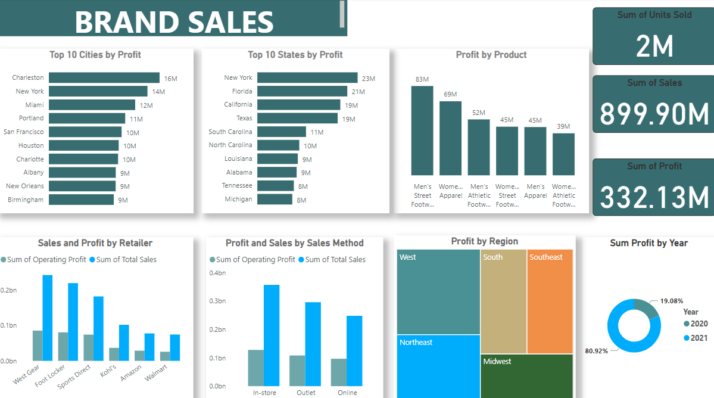

# Happy Feet Store Analysis

## Introduction
This is a Power BI project on sales analysis of an imaginary store called **Happy Feet**. This project is to analyze and derive insights to answer crucial questions and help the store make data driven decisions.

_**Disclaimer**: All datasets and reports do not represent any company, institution or country, but just a dummy dataset to demostrate capabilities of Power BI._

## Problem Statement
1. Total sum of units sold, sum of sales and sum of profit
2. What Sales Method made the most sales and profit
3. Which cities, Retailer, Region made the most sales and profit
4. What is the Operating Margin by Region, Retailer and Product

## Data Sourcing
Data was downloaded from the web as excel file and then imported into Power BI for analysis.

## Data Transformation
- Data transformation and cleaning was carried out using Power Query in Power BI. 
- The data was screened for duplicates.
- Column quality was viewed to check that there were no errors in the columns.

---

## Data Visualization
This report comprises of 2 pages

## Data Analysis
- A total of 2 million units were sold, 899.90 million was made from sales and a profit of 333.13 million was made.
- In-store sales methood made more profit and sales compared to Oulet and Online sales method.
- Top 10 cities by profit are Charleston, New York, Miami, Portland, San Fransico, Houston, Charlotte, Albany, New Orleans, Birmingham.
- New York, Florida and California are the top 3 states by profit.
- West Gear made the most sales and profit while Walmart made the least sales and profit.
- The product with most profit was Men's Street Footwear and least profit was Women's Alethic Footwear.
- West region sold the most units, followed by Northeast, South, Southeast and Midwest sold the least profit.
- Foot Locker Retailer had the highest count of Operating Margin while Walmart had the least.
- Northwest region had the highest Operating Margin.
- New York City sold the most units.

---
You can interact with the report [here](https://app.powerbi.com/view?r=eyJrIjoiOWE0YWNhMzEtNWExNC00ZWFjLWEwODMtMjg4NmVkZjgxMzUxIiwidCI6IjdhMTVkMzY1LTc3YTgtNGEzOC1iN2QyLTJiYzg0ZjYzN2JhOCJ9)

---
#THE END

